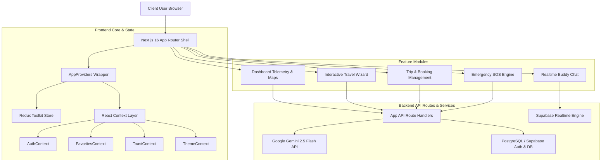
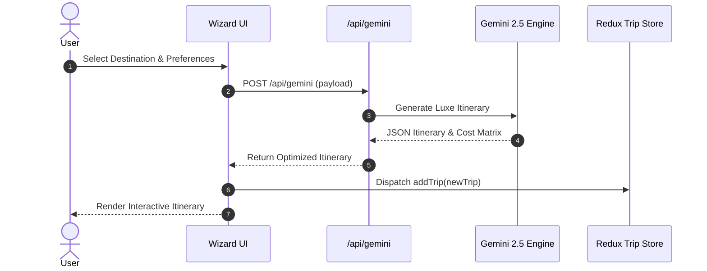
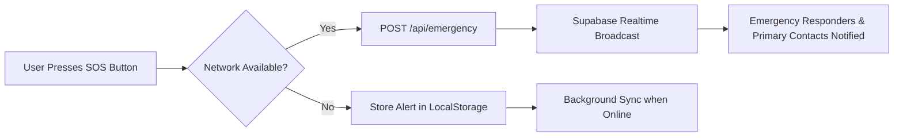

# 🏔️ PlanYatri — Architectural Documentation & Feature Deep-Dive

Welcome to the definitive architectural guide for **PlanYatri** (`Priyankkhatri/PlanYatri`), the unified luxury travel orchestration platform result of migrating and refactoring **YatraWay** into Next.js 16 (App Router), React 19, TypeScript, Tailwind CSS, Supabase, Redux Toolkit, and Google Gemini AI.

---

## 📐 System Architecture Overview

PlanYatri unites real-time telemetry, offline/online fallback state, emergency dispatch, and AI itinerary generation into a unified Next.js App Router architecture.

---

## ⚡ Unified Feature Breakdown

### 1. 🧙‍♂️ Interactive Travel Wizard (`/wizard/...`)
- **Multi-step Travel Configurator**: Dynamic step wizard covering destination selection, travel dates, companion profile, comfort preferences, stay style, transport modes, and AI comparison matrices.
- **Motion Graphics Telemetry**: Integrated **VelocityPulse** component rendering smooth real-time pulsing animations for telemetry calculations.

---

### 2. 🚨 Emergency SOS & Concierge Dispatch (`/emergency`)
- **Instant SOS Signal**: Pulsing, high-visibility emergency trigger sending location coordinates directly to pre-configured emergency contacts and regional tourist helplines.
- **Offline Protocol**: Graceful fallback storing emergency telemetry locally via `useStorage` when network connectivity drops.

---

### 3. 🗺️ Exploration Map & Visual Telemetry (`/dashboard`)
- **Dual Map Engine**: Combines **Leaflet Interactive Maps** with custom **Google Animated Map** vector overlays.
- **Metric Cards**: Real-time spending tracker, active trip progress indicators, and saved luxury destination bookmarks.

---

### 4. 💬 Realtime Companion Chat & Travel Buddies (`/messages`)
- **Supabase Realtime Sync**: Instant messaging channel allowing solo travelers and tour groups to coordinate excursions in real-time.
- **Automated Profile Trigger**: PostgreSQL database trigger `on_auth_user_created` automatically provisions user profiles upon signup.

---

## 🎨 Design System & Motion Graphics

PlanYatri employs an **Editorial Luxury Aesthetics Palette**:

| Color Name | Hex Code | Purpose |
| :--- | :--- | :--- |
| **Warm Canvas** | `#FAF8F5` | Primary Application Background |
| **Obsidian Slate** | `#18181B` | Primary Typography & Dark UI Panels |
| **Champagne Gold** | `#D4A843` | Luxury Badges & Accent Highlights |
| **Paper Border** | `#EFEAE2` | Subtle Divider & Card Boundaries |
| **Crimson SOS** | `#EF4444` | High-Priority Emergency Signals |

### Motion Graphics & Animations
- **Framer Motion PageTransitions**: Smooth opacity & Y-axis translation on route changes.
- **VelocityPulse**: Canvas/SVG shimmer animations depicting live telemetry updates.
- **Card Hover Elevation**: Cubic-bezier transition curves on destination cards.

---

## 📦 Migration Summary Highlights

- **Commits Executed**: 110+ Granular Conventional Commits (`feat`, `style`, `types`, `refactor`, `docs`, `chore`).
- **Language Upgrade**: 100% React JS/JSX converted into strongly typed TypeScript (`.ts`/`.tsx`).
- **Architecture**: Converted Vite SPA routing into Next.js 16 App Router file-system routes and API handlers.
- **Zero Downtime**: All existing PlanYatri wizard components preserved and seamlessly merged with YatraWay telemetry!

---
*Generated automatically by Antigravity DevOps Migration Engine.*