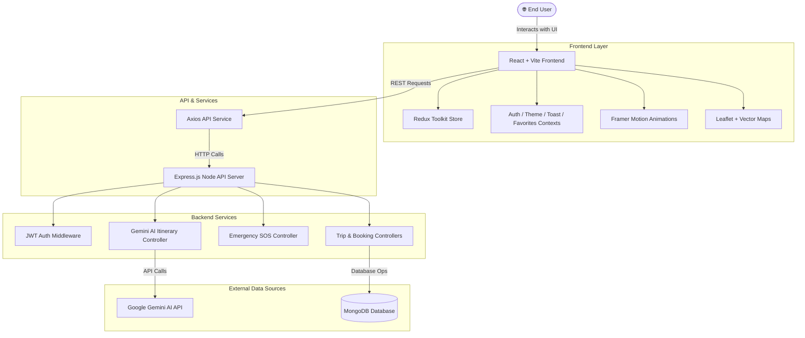

# 🌍 PlanYatri — Premium AI-Powered MERN Travel Platform

<div align="center">


[](https://github.com/Priyankkhatri/PlanYatri)
[](https://vitejs.dev/)
[](https://react.dev/)
[](https://redux-toolkit.js.org/)
[](https://tailwindcss.com/)
[](LICENSE)

<p align="center">
  <b>PlanYatri</b> is a state-of-the-art luxury travel planning web application built on the MERN Stack. It features real-time interactive vector maps, AI-assisted travel recommendations, a bespoke gold/obsidian design system, an emergency rescue SOS broadcasting system, and intelligent itinerary management.
</p>

[Explore Documentation](frontend/docs/PLANYATRI_ARCHITECTURE_FEATURES.md) • [Report Issue](https://github.com/Priyankkhatri/PlanYatri/issues) • [Request Feature](https://github.com/Priyankkhatri/PlanYatri/issues)

</div>

---

## 📖 System Architecture & Feature Deep-Dive

For complete architectural diagrams, Mermaid sequence flows, and component specs, refer to:
👉 **[`frontend/docs/PLANYATRI_ARCHITECTURE_FEATURES.md`](frontend/docs/PLANYATRI_ARCHITECTURE_FEATURES.md)**

---

## 📐 System Flow Diagram



---

## 🏗️ Repository Architecture

The project is structured as a clean, production-ready monorepo:

```text
PlanYatri/
├── frontend/                     # Vite 5 + React 18 SPA Frontend
│   ├── docs/
│   │   └── PLANYATRI_ARCHITECTURE_FEATURES.md
│   ├── public/                   # Static assets, sitemap, robots.txt
│   ├── src/
│   │   ├── components/           # Reusable UI components & maps
│   │   │   ├── auth/             # Auth forms & heroes
│   │   │   ├── dashboard/        # Stat cards, trip lists, explore cards
│   │   │   ├── icons/            # Luxury custom SVG icons
│   │   │   ├── layout/           # Sidebar, Topbar, Header
│   │   │   ├── GoogleAnimatedMap.jsx
│   │   │   ├── InteractiveMap.jsx
│   │   │   ├── PageTransition.jsx
│   │   │   └── ProtectedRoute.jsx
│   │   ├── context/              # Auth, Storage, Favorites, Theme, Toast
│   │   ├── data/                 # Mock datasets & Unsplash place images
│   │   ├── hooks/                # Custom React hooks (useFetch, useDebounce, etc.)
│   │   ├── pages/                # Application routes & views
│   │   │   ├── Bookings.jsx
│   │   │   ├── Dashboard.jsx
│   │   │   ├── Destinations.jsx
│   │   │   ├── Emergency.jsx
│   │   │   ├── Experiences.jsx
│   │   │   ├── Favorites.jsx
│   │   │   ├── LoginPage.jsx
│   │   │   ├── Messages.jsx
│   │   │   ├── Profile.jsx
│   │   │   ├── Settings.jsx
│   │   │   ├── TravelStyle.jsx
│   │   │   └── Trips.jsx
│   │   ├── services/             # Axios API client & image services
│   │   ├── store/                # Redux Toolkit slices (auth, trips, emergency)
│   │   ├── App.jsx               # Router & root provider tree
│   │   ├── main.jsx              # React application entry point
│   │   └── index.css             # Global Tailwind & luxury style tokens
│   ├── index.html
│   ├── package.json
│   ├── tailwind.config.js
│   └── vite.config.js
├── backend/                      # Node.js + Express REST API Server
│   ├── controllers/              # Express route controllers
│   ├── middleware/               # Authentication & error middleware
│   ├── routes/                   # Endpoint routers (auth, trips, emergency, upload)
│   ├── uploads/                  # Media upload directory
│   ├── server.js                 # Express server startup entry point
│   ├── package.json
│   └── render.yaml               # Deployment config for Render
├── .gitignore
└── README.md
```

---

## ✨ Key Features

- 🏔️ **Interactive Destination Explorer**: Filter 120+ global luxury destinations by region, budget, and travel style.
- ✈️ **Smart Trip Planner**: Full itinerary orchestrator with day-by-day activity tracking and budget breakdown.
- 🆘 **Emergency Rescue SOS Engine**: Real-time GPS coordinate broadcasting, Audio Siren alarm, and nearest medical facility locator.
- 🎨 **Luxury Dark/Light Design System**: Tailored gold (`#D4A843`) and obsidian charcoal aesthetic with Framer Motion spring physics.
- 🔐 **Secure Authentication**: JWT-backed authentication with quick demo login functionality.
- 🗺️ **Dual Vector Mapping**: Leaflet.js interactive tile maps integrated with animated vector overlays.

---

## ⚡ Quick Start Guide

### 1. Prerequisites
- **Node.js**: `v18.0.0` or higher
- **npm**: `v9.0.0` or higher

### 2. Clone the Repository
```bash
git clone https://github.com/Priyankkhatri/PlanYatri.git
cd PlanYatri
```

### 3. Backend Setup
```bash
cd backend
npm install
npm run dev
```
> Server runs on `http://localhost:5000`

### 4. Frontend Setup
```bash
cd ../frontend
npm install
npm run dev
```
> Application runs on `http://localhost:5173`

---

## 🔑 Environment Variables

### Backend (`backend/.env`)
```env
PORT=5000
MONGO_URI=mongodb://localhost:27017/planyatri
JWT_SECRET=your_super_secret_jwt_key_here
GEMINI_API_KEY=your_google_gemini_api_key_here
```

### Frontend (`frontend/.env`)
```env
VITE_API_URL=http://localhost:5000/api
```

---

## 🛰️ REST API Endpoints Overview

| Method | Endpoint | Description | Auth Required |
| :--- | :--- | :--- | :---: |
| `POST` | `/api/auth/register` | Register a new user account | ❌ |
| `POST` | `/api/auth/login` | Authenticate user & receive JWT | ❌ |
| `GET` | `/api/trips` | Fetch all user itineraries | ✅ |
| `POST` | `/api/trips` | Create a new trip itinerary | ✅ |
| `DELETE` | `/api/trips/:id` | Cancel/delete an itinerary | ✅ |
| `POST` | `/api/emergency/sos` | Trigger emergency SOS signal | ✅ |
| `POST` | `/api/gemini/generate` | Generate AI travel recommendation | ✅ |

---

## 🎨 Design Tokens & Color Palette

| Token Name | Hex Value | Application |
| :--- | :--- | :--- |
| **Obsidian Charcoal** | `#18181B` | Primary Dark Panels & Typography |
| **Champagne Gold** | `#D4A843` | Luxury Accents & Active Badges |
| **Warm Canvas** | `#FAF8F5` | Light Mode Background Canvas |
| **Paper Divider** | `#EFEAE2` | Subtle Structural Borders |
| **Emergency Crimson** | `#EF4444` | High-Priority SOS Controls |

---

## 📜 License

Distributed under the **MIT License**. See `LICENSE` for more information.

---

<div align="center">
  Crafted with ❤️ by <b>Priyank Khatri</b> for <b>PlanYatri Platform</b>
</div>
