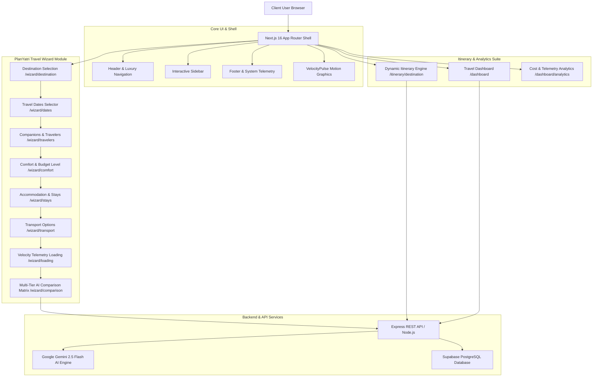
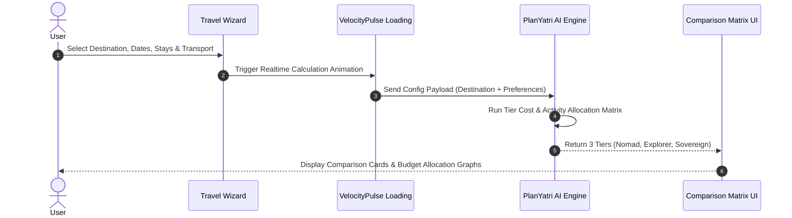
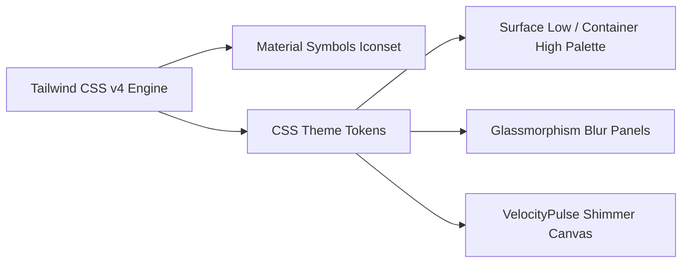

# 🏔️ PlanYatri — Architectural Documentation & Feature Deep-Dive

Welcome to the definitive architectural guide for **PlanYatri** (`Priyankkhatri/PlanYatri`), an enterprise-grade luxury travel orchestration platform built with Next.js 16 (App Router), React 19, TypeScript, Tailwind CSS v4, Redux Toolkit, and Google Gemini AI.

---

## 📐 System Architecture Overview

PlanYatri provides an end-to-end intelligent travel planning pipeline, combining a multi-step travel wizard, a multi-tier AI cost comparison matrix, interactive destination itineraries, and live velocity telemetry.

---

## ⚡ PlanYatri Core Feature Breakdown

### 1. 🧙‍♂️ Multi-Step Interactive Travel Wizard (`/wizard/...`)
PlanYatri features an interactive multi-step configurator that captures user travel parameters before invoking AI itinerary generation:

1. **Destination Selector (`/wizard/destination`)**: Searchable global destination picker with high-resolution visual previews.
2. **Date Configurator (`/wizard/dates`)**: Interactive date-range calendar picker for trip duration.
3. **Companion & Traveler Selector (`/wizard/travelers`)**: Single, Couple, Family, or Group traveler profile config.
4. **Comfort & Budget Level (`/wizard/comfort`)**: Slider & card controls for budget flexibility (Nomad vs Explorer vs Sovereign).
5. **Accommodation & Stays (`/wizard/stays`)**: Hotel, Boutique Resort, Lakeside Tents, or Heritage Glamping options.
6. **Transport Modes (`/wizard/transport`)**: Shared Transfer, Private SUV (Innova/Xylo), or Luxury 4x4 Off-roader (Fortuner).
7. **Velocity Telemetry Loading (`/wizard/loading`)**: Animated loading state powered by `VelocityPulse`.

---

### 2. 💎 Multi-Tier AI Comparison Matrix (`/wizard/comparison`)
PlanYatri automatically generates a 3-tier comparative matrix so travelers can evaluate budget vs luxury options:

| Tier | Name | Estimated Price | Key Transportation | Accommodation Style |
| :--- | :--- | :--- | :--- | :--- |
| **Budget** | **The Nomad** | ₹35,000 / person | Shared Taxi / Group Transfers | Authentic Homestays & Hostels |
| **Balanced** | **The Explorer** *(Most Popular)* | ₹78,000 / person | Private Xylo / Innova SUV | 3-Star Boutique Hotels & Tents |
| **Luxury** | **The Sovereign** | ₹1,55,000 / person | Private 4x4 Fortuner Off-roader | Luxury Heritage Camps with Butler |

#### 📊 Cost Analytics & Allocation Engine
- **Transportation Allocation**: 35% of overall budget.
- **Accommodation Allocation**: 45% of overall budget.
- **Potential Savings Calculator**: Instant calculation of savings delta (e.g., ₹35,500 potential saving).
- **Luxury Delta Metric**: Highlights premium add-ons (+ ₹77,000 for butler & private glamping).

---

### 3. 🗺️ Destination Itinerary Engine (`/itinerary/[destination]`)
- **Day-by-Day Activity Timelines**: Hour-by-hour schedules covering arrival, hotel check-in, guided tours, and dining.
- **Interactive Map Visualizer**: Integrated map rendering activity coordinates and route polylines.
- **Altitude & Climate Telemetry**: Real-time environmental metrics for high-altitude destinations.

---

### 4. 📈 Telemetry Dashboard & Analytics Suite (`/dashboard` & `/dashboard/analytics`)
- **Active Trip Monitoring**: Instant tracking of upcoming expeditions, budget vs spent metrics, and reservation vouchers.
- **Velocity Analytics Graphs**: Interactive breakdown of spending patterns, trip progress, and potential saving alerts.

---

## 🎨 Motion Graphics & Luxury Design System

PlanYatri employs an **Editorial Luxury Design Tokens Engine**:

### Color Palette Tokens
- **Primary Brand Purple**: `#4D41DF` (`var(--color-primary)`)
- **Luxury Gold Accent**: `#D4A843` / `#B65C00` (`var(--color-tertiary)`)
- **Warm Editorial Background**: `#FAF8F5` (`var(--color-background)`)
- **Surface Container**: `#EEEEEE` (`var(--color-surface-container)`)
- **Obsidian Typography**: `#18181B` (`var(--color-on-surface)`)

### Motion Graphics Components
- **`VelocityPulse`**: Live canvas & SVG pulsing status indicator rendering real-time telemetry updates.
- **Framer Motion Route Animations**: Smooth page transitions with vertical y-axis translation and cubic-bezier easing curves.
- **Elevation Hover States**: Subtle hover elevation (`hover:translate-y-[-4px]`) on comparison cards.

---

## 🛠️ Project Workspace Structure

\`\`\`text
PlanYatri/
├── frontend/                     👉 Next.js 16 App Router Frontend (React 19, TypeScript, Tailwind)
│   ├── src/app/                  👉 App Router Pages (/wizard/..., /itinerary/[destination], /dashboard, etc.)
│   ├── src/components/           👉 UI Components (VelocityPulse, Header, Sidebar, Footer, StatCards, etc.)
│   ├── docs/                     👉 System Architecture Documentation (PLANYATRI_ARCHITECTURE_FEATURES.md)
│   ├── package.json
│   └── tsconfig.json
│
├── backend/                      👉 Express REST API & AI Gemini Microservice (TypeScript)
│   ├── src/controllers/          👉 Controllers (trips, bookings, emergency, gemini)
│   ├── src/routes/               👉 Endpoint Routes (/api/trips, /api/gemini, /api/emergency)
│   ├── sql/                      👉 Supabase SQL Schema (supabase_migration.sql)
│   ├── package.json
│   └── tsconfig.json
│
└── README.md                     👉 Root Monorepo Developer Quickstart Guide
\`\`\`

---
*PlanYatri Architectural Documentation v2.0.*